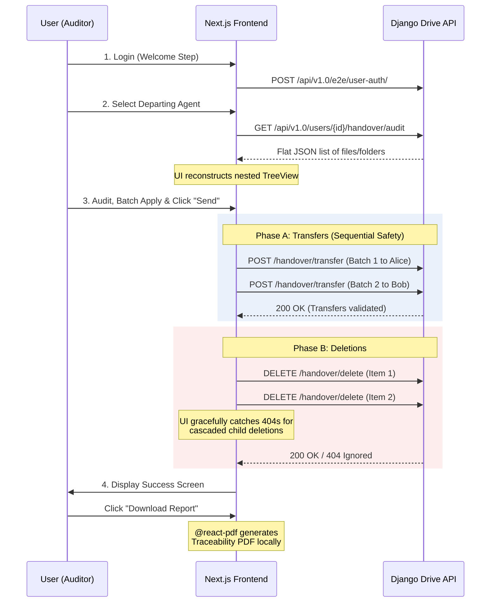

# 🗂️ Passation - Drive Offboarding Tool

**Passation** is a Next.js frontend application designed to manage the handover process of a departing employee's Drive space within **La Suite Numérique**.

It provides managers and auditors with a secure, visual, and sequential interface to inspect a user's directory tree, reassign file ownership to appropriate successors, and safely delete obsolete folders—culminating in a downloadable PDF traceability certificate.

---

## ✨ Key Features

- **Virtualized Directory Tree**: Renders thousands of nested files and folders smoothly using `react-arborist`.
- **Smart Filtering & Sorting**: Multi-column sorting (Name, Date) and a "Sole Owner" quick-filter to instantly identify critical files at risk of being lost.
- **Batch Operations**: Assign entire folder branches to a specific colleague in one click.
- **Safe Sequential Processing**: Prevents backend race conditions by ensuring ownership transfers are fully validated before any cascading folder deletions occur.
- **Traceability Report**: Generates an on-the-fly PDF certificate detailing exactly what was transferred (and to whom) and what was deleted, complete with original file paths and timestamps.

---

## 🛠️ Tech Stack & Libraries

This project is built with **Next.js (App Router)** and relies on the following core libraries:

*   **[`@gouvfr-lasuite/ui-components`](https://suitenumerique.github.io/ui-kit/)**: The official UI Kit for La Suite Numérique. Used for all semantic styling, buttons, inputs, modals, and standardized file icons.
*   **[`react-arborist`](https://github.com/jameskerr/react-arborist)**: A highly optimized, virtualized React tree component used to display the hierarchical structure of the audited Drive space.
*   **[`@react-pdf/renderer`](https://react-pdf.org/)**: A powerful library used to generate the final "Passation Certificate" PDF natively on the client side.

---

## 🔌 API Connections & Architecture

The application acts as a client for a **Django Backend API**. It handles standard authentication cookies and explicitly parses `csrftoken` cookies to secure state-changing requests (`POST`, `DELETE`).

### Workflow & Architecture (Mermaid)



### API Endpoints Used

1.  **Auth**: `POST /api/v1.0/e2e/user-auth/`
2.  **Audit Data**: `GET /api/v1.0/users/{id}/handover/audit` (Returns a flat list of `HandoverAuditItem` objects mapped locally to a Tree).
3.  **Transfer**: `POST /api/v1.0/users/{id}/handover/transfer` (Expects `recipient_id` and an array of `item_ids`).
4.  **Delete**: `DELETE /api/v1.0/users/{id}/handover/delete` (Expects `item_id` and `title`).

---

## 🚀 Getting Started

### Prerequisites
Ensure your local Django Drive backend is running and accessible on [http://localhost:3000](http://localhost:3000) (typically proxied via `next.config.mjs` to avoid CORS issues during development).

### Installation

1. Clone the repository and install dependencies:
```bash
npm install
```
*(Note: If you encounter peer dependency issues related to React 19 and `@react-pdf/renderer` or `react-aria`, use `npm install --legacy-peer-deps`).*

2. Run the development server:
```bash
npm run dev
```

3. Open [http://localhost:3001](http://localhost:3001) with your browser to start the offboarding wizard.

---

## 📝 Folder Structure

*   `app/page.tsx` - Main orchestrator containing the Stepper, global state, and API payload sequencing.
*   `app/components/WelcomeStep.tsx` - Initial landing and authentication step.
*   `app/components/AgentSelectionStep.tsx` - Selection of the departing user.
*   `app/components/AuditStep.tsx` - Core workspace containing the `react-arborist` tree, sorting logic, sole-owner filtering, and batch operations.
*   `app/components/SuccessStep.tsx` - Final success screen embedding the `@react-pdf/renderer` logic for the downloadable handover certificate.
